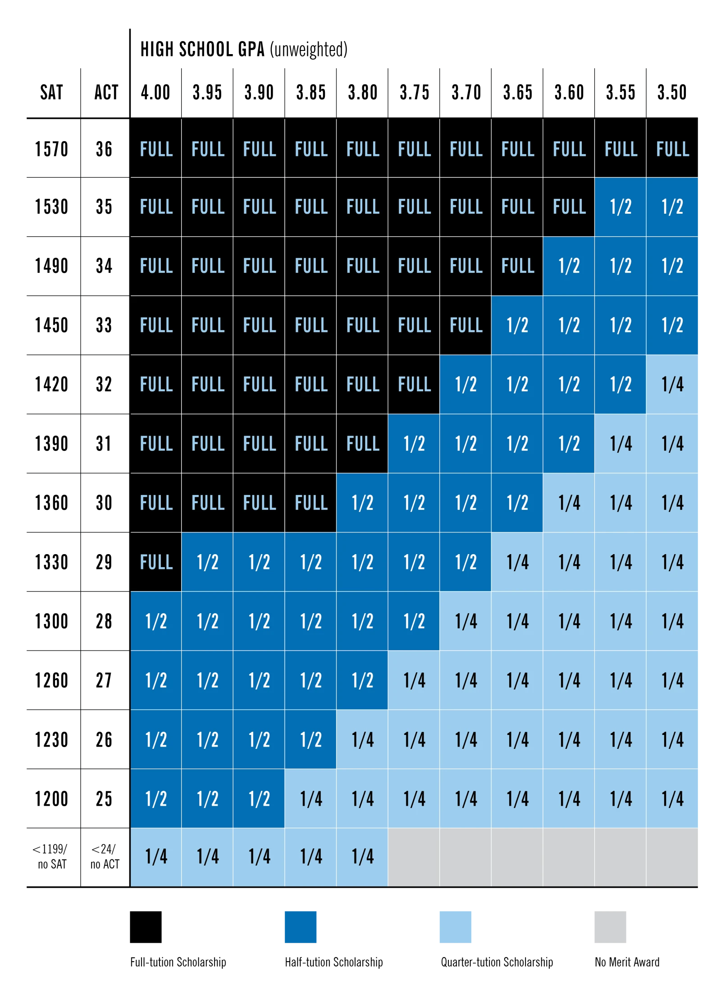

# Tuition Calculator

This code is meant to create an interactive way to let new students find the right scholarship amount they woudl get based on GPA and ACT/SAT scores.

### Technologies used:
- HTML
- CSS
- JS

This project was not planned to be hosted by an external service, instead it would be added to the current page structure as a code block. As such, there were some complications to ensure that everything worked as expected.

The original design used three different files (all included in this repository), but to get the calculator working in the current website we needed to have everything in one single code block, as simple as this:

```html
<div>
    <style>
        /* All the styles defined in the CSS file are added here */
    </style>

    <main>
        <!-- HTML structure is placed here, some styles are hard-coded here because the change needed was minimal and potentially unique -->
    </main>

    <script>
        /* All the Javascript logic is inclued here */
    </script>
</div>
```
This version of the completed code is placed in the [Full Calculator](fullCalculator.html) file. However, Brightspot uses Bootstrap for its styles, and the original design for this calculator was made without it. This caused some styling issues when rendering the full code into the school's website. To account for this the version that is used in Brigthspot has some edited styles to make sure that the desgin matches the proposal. The code with the **complete live code** can be found in the [Brightspot-Version Calculator](brightspot_version.html).
## Structure
The Calculator is separated into two screens with different components: 
- Calculator
    - Divided in two sections: 
        - Freshman:
            - Calculates based on GPA and ACT/SAT scores.
        - Transfer Student:
            - Calculates based on GPA.
    - Each section will check for church membership and check if the student is a recently returned missionary.

- Results
    - Has three main componnents:
        - Descriptive Animation:
            - Displays cost of tuition per semester. It will change if the prospective student is a member of the church or not.
            - Depending on the results of the calculation it will display the percentage of scholarship by filling a cirlcle (representing 100% of tuition) to indicate how much tuition would be covered by the total sum of the scholarships.
            - It will also show in different colors the amount of Merit Scholarship and the amount of Returned Missionary Scholarship (if applicable). 
            - It clearely states the total amount of scholarship received.
        - Scholarship Breakdown:
            - If the a scholarship is given, this section will show the correct amount distributed from the Merit Scholarship and the Returned Missionary Scholarship (if applicable).
        - Semester Tuition Breakdown:
            - This section will show the amount that the perspective student must pay after applying the scholarships.
            - If the merit scholarship pays for full tuition and the student is a recently returned missionary, an additional line will appear stating that there will be a one-time "excess" total to the amount of the RM Scholarship.
    - If the student doesn't qualify for any scholarship the screen will have a link to see more Financial Aid Options, and it will display the total amount of tuition.


## Important Details

The calculator's logic is based on tuition and scholarship values as of 2025. In future years, these values may change—such as updated tuition rates for members and non-members, adjustments to the Returned Missionary Scholarship, or revised discount percentages for Freshman and Transfer students.

In this section, I’ll break down how the calculator manages these variables and explain how to update them as needed.

### Cost of tuition
The tuition calculation is based on two primary variables:

1. Member tuition
2. Non-Member tuition

These values are hard-coded near the top of the calculator’s script, as shown below:

javascript
Copy
Edit

```js
let memberTuition = 2400; //Amount in USD
let nonMemberTuition = 4800; //Amount in USD
```
To update the tuition amounts, simply navigate to the `<script>` tag in the code and modify these values accordingly.

### Returned Missionary Scholarship
This scholarship is a fixed amount and does not require any additional calculation. It’s defined directly after the tuition variables:
```js
let missionaryScholarship = 1000; //Amount in USD
```
To adjust the scholarship amount, locate this line in the script and update the value as needed.

### Definition of "Recently Returned Missionary"
The **Returned Missionary** checkbox includes the following statement: 

*I returned from a mission after Jan 1st ____*

The year in this statement is dynamically generated by subtracting 1 from the current year. This ensures the calculator always reflects a rolling timeframe—specifically, within two years of the stated date—without requiring manual updates each year.

The code that handles this logic is located at the bottom of the `<script>` tag and looks like this:

```js
    const date = new Date().getFullYear();
    document.querySelector('.rmYear').innerText = date - 1
```


### Freshman Scholarship Calculation:
All information shown in the calculator is based on this matrix: 


As of June 20th of 2025 this matrix can be found in the following page: https://www.byui.edu/financial-aid/merit-scholarship


To represent this logic in code, I created a 13x11 matrix (starting form 0 for code logic) that defines the percentage of tuition discount based on a student's GPA and ACT score:

```js
let scholarshipMatrix = [ 
  //  0   1   2   3   4   5   6   7   8   9  10
    [100,100,100,100,100,100,100,100,100,100,100], // 0
    [100,100,100,100,100,100,100,100,100,50, 50],  // 1
    [100,100,100,100,100,100,100,100,50, 50, 50],  // 2
    [100,100,100,100,100,100,100,50, 50, 50, 50],  // 3
    [100,100,100,100,100,100,50, 50, 50, 50, 25],  // 4
    [100,100,100,100,100,50, 50, 50, 50, 25, 25],  // 5
    [100,100,100,100,50, 50, 50, 50, 25, 25, 25],  // 6
    [100,50, 50, 50, 50, 50, 50, 25, 25, 25, 25],  // 7
    [50, 50, 50, 50, 50, 50, 25, 25, 25, 25, 25],  // 8
    [50, 50, 50, 50, 50, 25, 25, 25, 25, 25, 25],  // 9
    [50, 50, 50, 50, 25, 25, 25, 25, 25, 25, 25],  // 10
    [50, 50, 50, 25, 25, 25, 25, 25, 25, 25, 25],  // 11
    [25, 25, 25, 25, 25,  0,  0,  0,  0,  0,  0]   // 12
]

```
To make this matrix usable in code, I also created JavaScript objects that map GPA values to their corresponding column indices, and ACT scores to their corresponding row indices:


<table>
<tr>
<th>GPA</th>
<th>ACT</th>
</tr>
<tr>
<td>

```js
let gpaCols = {
    "4.00": 0, 
    "3.95": 1,
    "3.90": 2, 
    "3.85": 3,
    "3.80": 4,
    "3.75": 5,
    "3.70": 6,
    "3.65": 7,
    "3.60": 8,
    "3.55": 9,
    "3.50": 10
    }
``` 
</td>
<td>

```js
let actRows= {
    "36": 0,
    "35": 1,
    "34": 2,
    "33": 3,
    "32": 4,
    "31": 5,
    "30": 6,
    "29": 7,
    "28": 8,
    "27": 9,
    "26": 10,
    "25": 11,
    "24": 12
    }
``` 
</td>
</tr>
</table>

The calculator's dropdown includes both GPA and ACT/SAT options, but only the equivalent ACT score is used to reference the actRows object and determine the correct row in the matrix.


If you need to update a specific percentage in the matrix, simply locate the correct **cell** based on the GPA (column) and ACT (row) relationship, and adjust the value directly.

If you need to **add or remove rows or columns**, follow these steps:

1. **Update the matrix** (`scholarshipMatrix`) to reflect the new structure and values.
2. **Modify the `actRows` and `gpaCols` objects** to match the new row and column definitions.
3. **Update the dropdown options** in the HTML form so users can select the correct ACT and GPA values that correspond to the new matrix.

This ensures the calculator stays in sync with any changes to scholarship criteria over time.

### Transfer Student Scholarship Calculation

Transfer students were instructed to provide only their current college GPA. Additionally, there are only three possible scholarship discount levels available to them: **100%**, **50%**, and **25%**.

I represented these discount levels using a simple array:

```js
let scholarshipTransferStudents = [
// 0,  1,  2
  100, 50, 25
]
```
To determine which discount a prospective transfer student qualifies for, their GPA falls into one of three predefined categories. I created a JavaScript object that maps each GPA range to its corresponding index in the **scholarshipTransferStudents** array:
```js
let gpaColsTransfer = {
  "3.75 - 3.899": 2, 
  "3.90 - 3.95": 1,
  "3.95 - 4.0": 0, 
}
```

If the scholarship structure for transfer students changes in the future, follow these steps:

1. **Update the scholarship amounts** in the `scholarshipTransferStudents` array to reflect new discount percentages.
2. **Update the `gpaColsTransfer`** object if the GPA brackets or number of categories change.
3. **Update the GPA dropdown** in the HTML form to make sure they match the updated GPA ranges used in the `gpaColsTransfer` object. This ensures users can only select valid inputs.

By keeping the array, the mapping object, and the HTML form options aligned, the calculator will continue to return accurate results for transfer students.
### Images
Because this project isn't hosted on its own website, accessing a dedicated image library for the illustrations was challenging. To work around this, we converted the images into SVG code, which allowed us to display them directly without needing to fetch resources from external sources.
## Potential Future Fixes
There are a couple of things I would suggest to change if at any time someone revisits the project

- Change the styles from simple CSS to Bootsrtap
- Implement error checking more thoroughly
- Host the calculator as a different page, and embed it in the website as an Iframe
- Add Data Layer push events to help track user interaction from GTM

